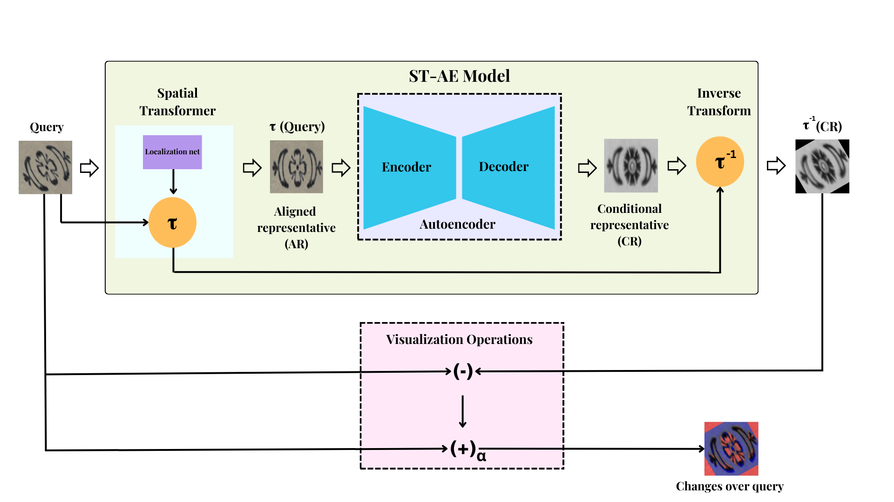
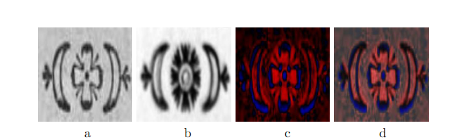
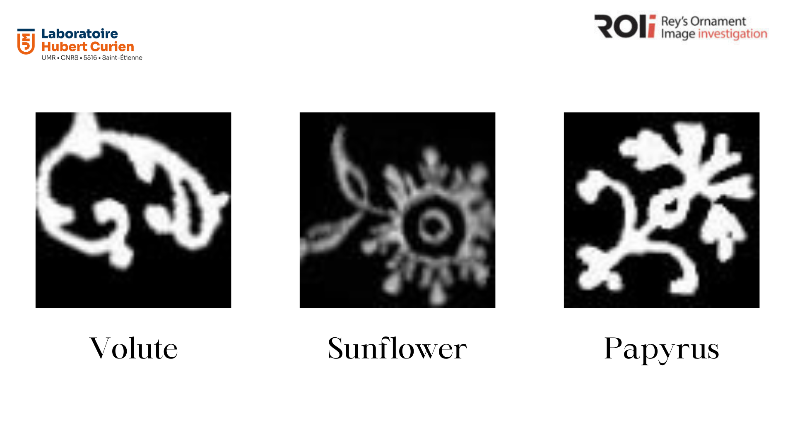

# STAE

This is an official implementation of the paper titled, "One-to-many pattern comparison combining fully-connected autoencoder with spatial
transformer for ornament investigation".

The schematic diagram of the model is given in the figure model.

 </img>

The following figure below is an example of our model followed by the change visualiszation tool.

</img>

The query shown in Fig. a is a compound ornament. It is compared to a taxon here figured out by its conditional representative (Fig. b)). The query pattern differs from the taxon mainly in the central part. The positive changes where ink is missing (especially in a ring around the central dot) can be observed in red. The negative ones where ink is in excess (especially the central dot) are in blue. The residual maps are displayed in Fig. c, it corresponds to α = 1 (it is the LIP interpolation weight). And, Fig. d shows RGB display according to α = 0.8


## General


Project Directories:

* 'data' : The directory to store your data.
* 'dispaly': Files to demonstrate change visualization.
* saved model': Directory to save your logs and saved models.
* 'utils':  Utilities to deonstrate metrics and test and train the model.


## Dependencies

This project requires Python versions 3.9 or higher and Tensorflow versions 2.14.1
```
git clone https://gitlab.univ-st-etienne.fr/cs103329/stae/-/tree/main?ref_type=heads
pip install -r requirements.txt
```

## Datasets

### MVTec Anomaly Detction Dataset

The MVTec AD is an anomaly detection dataset that can be used to study the performance of your model. For our case some of the classes of the MVTEC AD suit the type of defaults we want to study. The classes of textures we have test our defects are as follows:
* Carpet: Thread and Color
* Leather: Cut and Glue
* Tile: Crack and Gray

The dataset for the following classes can be downloaded from 
[link](https://www.mvtec.com/company/research/datasets/mvtec-ad/downloads).


### Modified Vignettes for Change Localization(MVCL)

One-to-one class comparison could be achieved in various situations, especially in document analysis in order to discover variants in a
corpus of ancient ornaments or analyze the way of handwriting a given digit. For such purposes, we generated a dataset, named MVCL (Modified
Vignettes for Change Localization).The dataset has three types of vignettes:

* Volute
* Papyrus
* Sunflower

 </img>

The link for the dataset shall be provided once the paper is accepted in the journal.

The `data` directory should look like this (if you have downloaded the datasets):

```
data
├── class 0
│   ├── test
│   ├── train
│   └── val
├── class 1
│   ├── test
│   ├── train
│   └── val
└── class 2
    ├── test
    ├── train
    ├── val
```

## Train
Download the dataset and put it into 'data' follwoing the above given folder strcuture.
Change the parameters of 'config.py' to suit the needs of the dataset.


```
python trainingscript.py [Training type] [Batch Siae] [Epochs] 
```

For example,
```
python trainingscript.py STAE1 32 1
```


## Test

For custom tests load the model saved in the 'saved_models' folder to load and run on your test dataset.

## Changes Visualization

The changes occurring in a given input query \(x\) can be viewed by subtraction with the conditional representative of the taxon class currently investigated. It requires to align representative \(y\) with input \(x\) i.e. transform ST-AE output \(y\) into image \(z\). In the present implementation, affine transformations (without skew) are considered in the localization module of the STN. The predicted values of the RST parameters are used to construct the inverse transformation to be applied to the ST-AE output. The RST assumption is usually sufficient when processing optically undistorted images of non-curved surfaces. 

The IC-STN geometric predictor that is able to directly predict the inverse parameters (of affine transformations) could be advantageously used instead. Indeed, it solves the issue of boundary artifacts which were identified as causing some failure of the ST-AE model on data with textured background.

To use the visualisation tool, you are encouraged to run the matlab codes given in the `display` folder, with the real valued matrix of the query (x) and the conditional representative (y) as the inputs, as follows:

```
function seeXthroughY(x,y,COLOR)

```


 </img>

